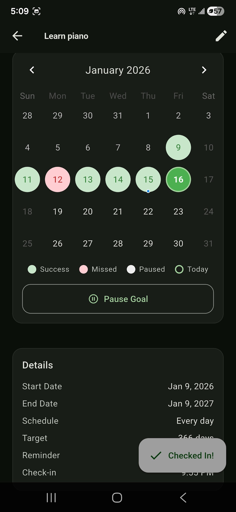
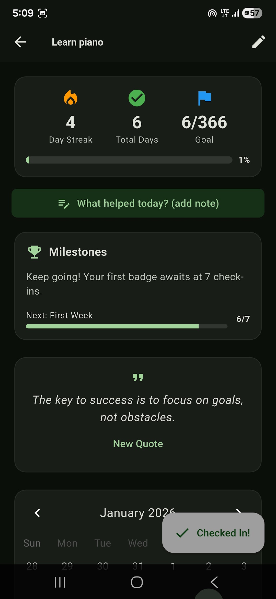
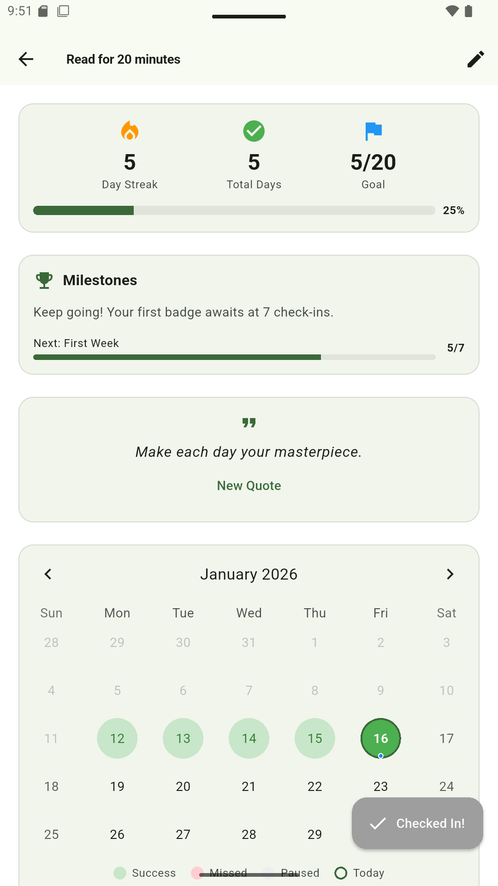

# StreakUp

Habit tracker for building streaks on real goals: daily or weekly schedules, check-in and motivational reminders, milestone badges, reflection notes, and a calendar view of every success and miss. Live on Google Play, localized in 7 languages, light and dark themes.

| Calendar | Goal detail | Light theme |
| :---: | :---: | :---: |
|  |  |  |

Built with Flutter. The app source is private; this repo hosts the landing page ([index.html](index.html)).

By [Alexander Kemos](https://github.com/AlexanderGRTCh), Ktisis Arc, Vancouver BC.
